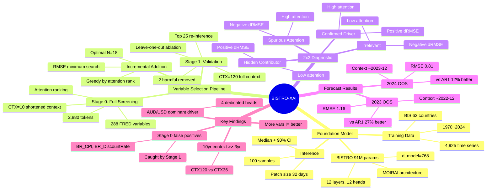

```mermaid
mindmap
  root((BISTRO-XAI))
    Foundation Model
      BISTRO 91M params
        MOIRAI architecture
        12 layers, 12 heads
        d_model=768
      Training Data
        BIS 63 countries
        4,925 time series
        1970~2024
      Inference
        Patch size 32 days
        100 samples
        Median + 90% CI
    Variable Selection Pipeline
      Stage 0: Full Screening
        288 FRED variables
        CTX=10 shortened context
        2,880 tokens
        Attention ranking
      Stage 1: Validation
        Top 25 re-inference
        CTX=120 full context
        Leave-one-out ablation
        2 harmful removed
      Incremental Addition
        Greedy by attention rank
        RMSE minimum search
        Optimal N=18
    2x2 Diagnostic
      Confirmed Driver
        High attention
        Positive dRMSE
      Spurious Attention
        High attention
        Negative dRMSE
      Hidden Contributor
        Low attention
        Positive dRMSE
      Irrelevant
        Low attention
        Negative dRMSE
    Forecast Results
      2023 OOS
        Context ~2022-12
        RMSE 1.16
        vs AR1 27% better
      2024 OOS
        Context ~2023-12
        RMSE 0.81
        vs AR1 12% better
    Key Findings
      AUD/USD dominant driver
        4 dedicated heads
      More vars != better
      10yr context >> 3yr
        CTX120 vs CTX36
      Stage 0 false positives
        BR_CPI, BR_DiscountRate
        Caught by Stage 1
```
